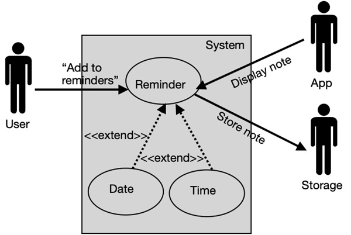
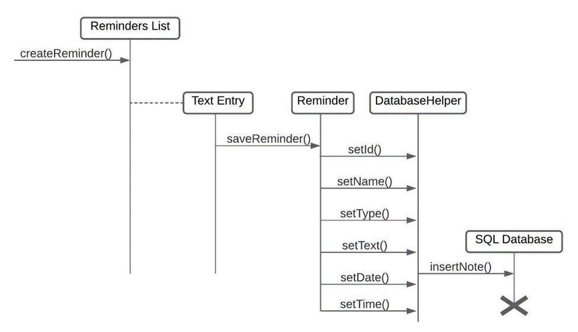
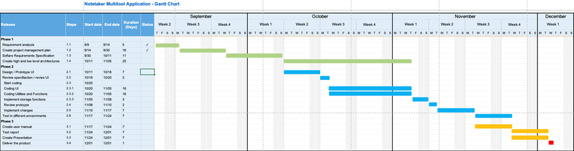
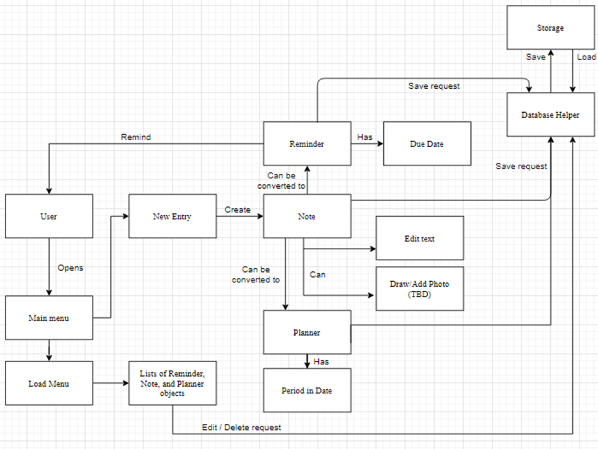
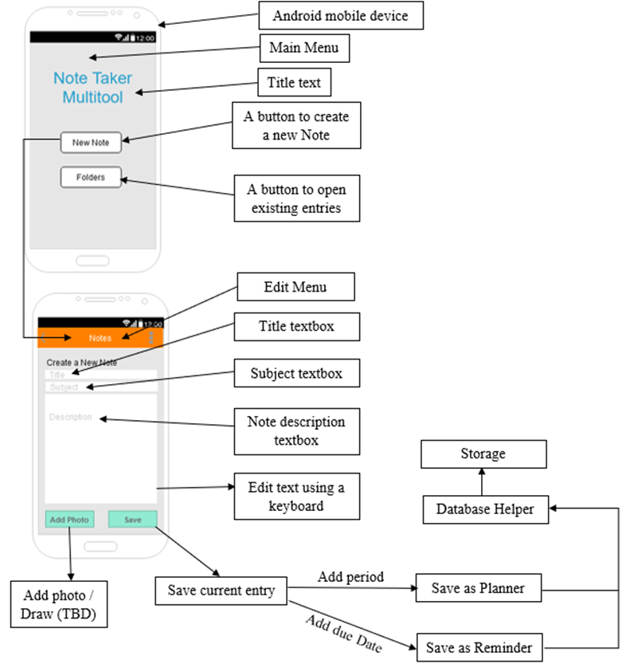
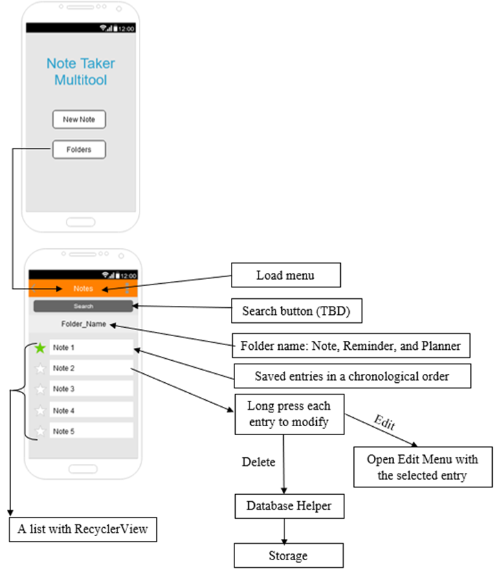

# Notetaker Multitool Application
An Android application with note, planner, and reminder features.

For more information, please read this full project report.

# Team Members

1. Juhyung Kim (me)
2. Solomon Storts
3. Frank Bafford

# Objective 

Create an Android application with note, planner, and reminder feature to help students better organize their schoolwork through their mobile device. By combining those three features in one application, we aim to boost the user's productivity.

# Requirements

## Features

1. Allow users to take notes by typing words and drawing.
2. Allow users to create a planner event by attaching a date to a note. 
3. Allow users to create a reminder by attaching a time to a planner event.
    * The users must be able to mark the reminder as 'completed.'
4. The notes, planner events, and reminders must be able to be saved, loaded, and edited.

Each feature has specific priority, requirement, response sequence, etc. For example, the below image shows the use case scenario for a reminder creation process.

The below is a UML Message Sequence Charts for the same activity.

## Constraints

1. The application must work in an Android environment.
    * Our target API is API level of 25 - with minimum 20 and maximum 30.
2. We must provide appropriate graphical user interface to ensure positive user experience.

# Planning 

The details about project management, like software development lifecycle model, schedule, timeline, activity graph, quality assurance plan, documentation plan, risk management plan, and other technical considerations, can be found in the full, comprehensive report.

For example, here is a Gantt Chart we used for time management:

# Result

## Resources Used

1. Java (Android Studio)
  * Java has extensive online resources for Android application development.
  * Android Studio is a specialized tool for Android application development.

2. Wireframe UI Designs
    * It assisted in designing UI, significantly improving our productivity.
   
3. Debugging with logcat
    * Its comprehensive logs helped us better understand our codes. 

## Architecture Used

The above diagram illustrates the major components in our system. The following is the description of each component:

1.	User - The person who uses this application.
2.	Storage - The local storage of the user’s device.
3.	Date - An object used to contain the time data.
4.	Note - An object that can store the text entry from the user. It can be saved in Storage with the help of Database Helper.
5.	List - The list of saved Notes, Calendar Events, and Reminders. The RecyclerView from the Android API will be used to display the items.
6.	Reminder - It extends from Note by adding a due Date on it. It will remind the User about the event when the due date arrives.
7.	Planner - It extends from Note by adding the start time and end time using the Date.
8.	Database Helper - This is the feature that saves the Notes, Calendar Events, and Reminder to the Storage. 
9.	Text Entry - The text input from the User.
10.	Create - The feature to create Notes, Calendar Events, and Reminder so the User can start adding the Text Entry.
11.	Delete - The feature to delete the saved Notes, Calendar Events, and Reminder.
12.	Edit - The feature to delete the saved Notes, Calendar Events, and Reminder.
13.	Remind - The feature that notifies the User when the saved Reminders hit their due date. 

## User Interface

 

The diagrams above show the design of graphical user interfaces and what each of them do.

## Evaluation

1. Reliability
    * Save, load, and edit functions as intended. 
    * We can add more measures to enhance the reliability such as creating temporary file to edit and save to save the draft in case of file corruption or data loss.

2. Reusability
    * We did not develop this application with reusability in mind because of its narrow scope. 

3. Maintainability
    * N/A - We will not be maintaining this application after the product is finished.

4. Testability
    * All the features worked as intended in our environment and a few testing environment.
    * More testing in the wild can improve the testing result. 
    
5. Performance
    * No performance issues found. This is a very light-weight program after all.
    * However, we often tested on emulated environment, so extra performance from the computer is considered.

6. Portability
   * Our application is for Android devices only. 
   * However, devices on different platforms can still view files created in the application using a generic text viewer programs.

7. Security
    * There is no in-application security features because many smartphone already have a built-in password feature and this app keeps the data locally (no potential data leak from internet connection).

8. Safety
   * N/A - None of our functions for this application will be able to cause harm to anyone else unless there is confidential content inside their notes. This issue would fall into security.

# Future Work Ideas

* Image attachment, multiple fonts, and different colors support
* Maximum document size
* Sorting features for reminders
* Calculator provided within the app
* Safety feature to prevent unwanted file override

# Lessons Learned
Through this project, the team learned several lessons regarding project management.

First, we saw the importance of planning a project, especially its timeline, as demonstrated in the comprehensive report. The activity graph and the Gantt chart were helpful guides to our development process to keep us on track throughout the semester. Additionally, specifying the team hierarchy, documentation plan, and technical requirements early on allowed us to avoid conflict later.  

Second, we learned the importance of precise and measurable requirements. For instance,  clear descriptions and plans allowed us to focus solely on implementation rather than having to redefine problems in the midway.

Third, using various visual components enhanced readability of documents, improving the productivity. For example the UML diagrams gave a clear visual representation of the functions. Additionally, illustrating the system’s high- and low-level architecture was critical to defining how we would implement our application later.

Overall, this project demonstrates the importance of early planning, team management, and precise requirement specification to develop an application smoothly.

